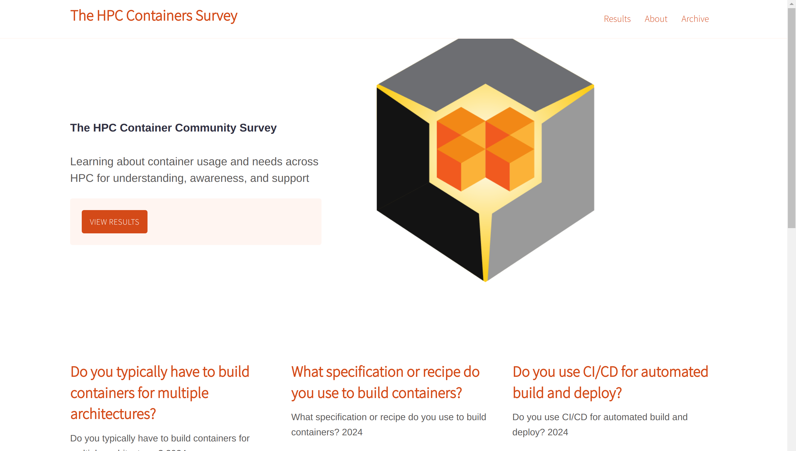

# HPC Containers Survey

[](https://doi.org/10.5281/zenodo.11206333)



This is the HPC Containers survey started in 2024 
Raw results are organized by year in the [data](data) folder and cleaned
(UI ready) data in [_data](_data) for jekyll to find. 
and will be deployed to an interface on GitHub pages (more likely).

 - [Results Data](data) that is downloaded from the Google Form (5/11/2024)
 - [Cleaned Data](_data) that is used on the site.

## Summary

 - **2024** We got a total of 202 responses!

## Development

### Local

To develop the survey, you'll need to [install jekyll](https://jekyllrb.com/docs/installation/) and [bundler](https://jekyllrb.com/tutorials/using-jekyll-with-bundler/) and then
after cloning the repository:

```bash
$ bundle install
$ bundle exec jekyll serve
```

And open your browser to [http://127.0.0.1:4000/hpc-containers-survey/](http://127.0.0.1:4000/hpc-containers-survey/)
to see the interface.

### Docker Compose

If you want to run docsy jekyll via a container for development (dev) or production (prod) you can use containers. This approach requires installing [docker-ce](https://docs.docker.com/engine/install/ubuntu/) that
now includes [docker-compose](https://docs.docker.com/compose/install/). You can see the configuration in the [docker-compose.yaml](docker-compose.yaml) file. 

#### Start Container

Once your docker-compose to download the base container and bring up the server:

```bash
$ docker compose up
```

You can then open your browser to [http://localhost:4000](http://localhost:4000)
to see the server running. Depending on if you choose 0.0.0.0 or localhost you might
have to go past the security warning about certificates.

#### Production

If you are deploying a container to production, you should remove the line to
mount the bundles directory to the host in the docker-compose.yml. Change:

```yaml
    volumes: 
      - "./:/srv/jekyll"
      - "./vendor/bundle:/usr/local/bundle"
      # remove "./vendor/bundle:/usr/local/bundle" volume when deploying in production
```

to:

```yaml
    volumes: 
      - "./:/srv/jekyll"
```

This additional volume is optimal for development so you can cache the bundle dependencies,
but should be removed for production. 

> Note : changes `baseurl: ""` in _config.yml  when you are running in local and prod according to the requirement.

## Instructions

### 1. Prepare Data

Since we need to do a bit of aggregation over values, the next step is to run the data file against
the [scripts/prepare_data.py](scripts/prepare_data.py) to generate the output file. It doesn't need any
special dependencies so you should be able to use your system Python. You can target
the file of interest directly, and it will rewrite to the same folder and filename as json.

```bash
$ python scripts/prepare_data.py data/raw/2024/containers-in-hpc.csv
```
This will generate a parsed json file of results:

```bash
$ ls _data/
containers-in-hpc.json
```

Finally, some manual work is needed to clean the results (e.g., consolidate different variations of NA into one "NA" category,
or other responses into an "Other" and that can be found in [_data/cleaned](_data/cleaned). This is the data that goes into
the site for graphs, and the file in root (the json we just produced) should be looked at when deriving manual insights.

##### Embed Results

You should then add a [result](_results) to the `_results` folder, where each file coincides with
a question (e.g., if we have the same question over two years it will be easy to compare the results).
If you have a new question, just create a new page! The original creator @vsoch chose Chart.js, but of course you can
change this plotting library if you like.

#### 5. Share Results!

Finally, make a new post under [_posts](_posts) that follows suit of the other post
to share an announcement for the results. 

### 2024

 - [Survey Form](https://forms.gle/EJTWtbJHPBhH8YdH6)


## Resources and Thanks

 - [color palettes](https://github.com/google/palette.js/blob/master/palette.js#L534) that are used in the plots can be seen here.
 - [jekyll-serif-theme](https://github.com/zerostaticthemes/jekyll-serif-theme)
